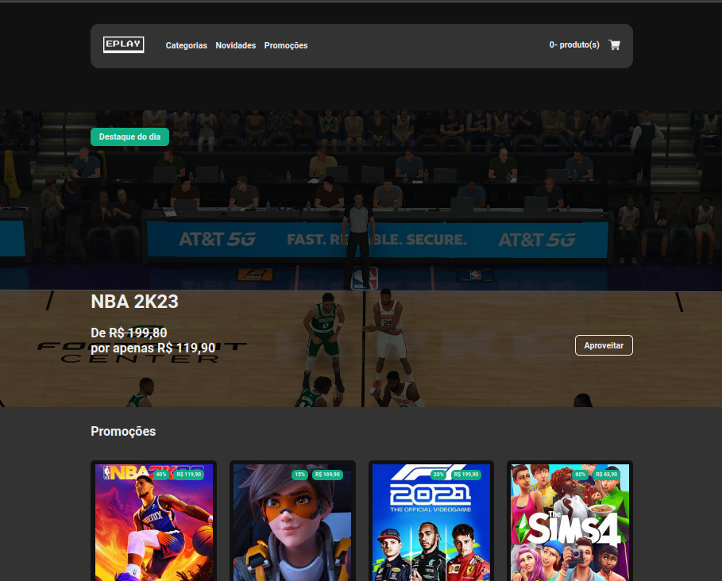

# EPLAY - E-commerce de Games Digitais

EPLAY é um projeto que simula uma plataforma de e-commerce de games digitais, permitindo aos usuários visualizar e comprar jogos oferecidos por diversos desenvolvedores. Utiliza requisições para listar jogos e suas respectivas informações por meio de uma API.

## Funcionalidades

- **Listagem de Jogos:** Os usuários podem visualizar uma lista de jogos disponíveis, cada um com sua descrição e imagens.
- **Detalhes do Jogo:** Ao clicar em um jogo, os usuários são redirecionados para uma página com a descrição detalhada do jogo e um botão para adicionar ao carrinho.
- **Categorias de Jogos:** A plataforma oferece páginas dedicadas a diferentes categorias de jogos, como em breve e promoções.
- **Carrinho de Compras:** Os clientes podem adicionar jogos ao carrinho e prosseguir para o pagamento.
- **Pagamento:** A plataforma oferece opções de pagamento por boleto e cartão de crédito.

## Tecnologias Utilizadas

- **React**: Utilizado para a construção da interface do usuário.
- **React Router DOM**: Para a navegação entre as diferentes páginas da aplicação.
- **Redux**: Gerenciamento de estado, especialmente para o carrinho de compras.
- **React Query**: Utilizado para realizar requisições e armazenar em cache os dados da API.
- **Styled-Components**: Biblioteca para estilização dos componentes.
- **TypeScript**: Adiciona tipagem estática ao JavaScript, aumentando a robustez e a manutenibilidade do código.
- **Formik**: adiciona tipagem estática ao JavaScript, aumentando a robustez e a manutenibilidade do código.
- **Yup**: uma biblioteca que permite validar os dados dos formulários.

## Como Executar

1. Clone o repositório do projeto:

```bash
git clone https://github.com/seu-usuario/eplay.git
Navegue até o diretório do projeto:
bash
Copy code
cd eplay
Instale as dependências:
bash
Copy code
npm install
# ou
yarn install
Inicie o servidor de desenvolvimento:
bash
Copy code
npm start
# ou
yarn start
Acesse o aplicativo em seu navegador através do endereço http://localhost:3000.
